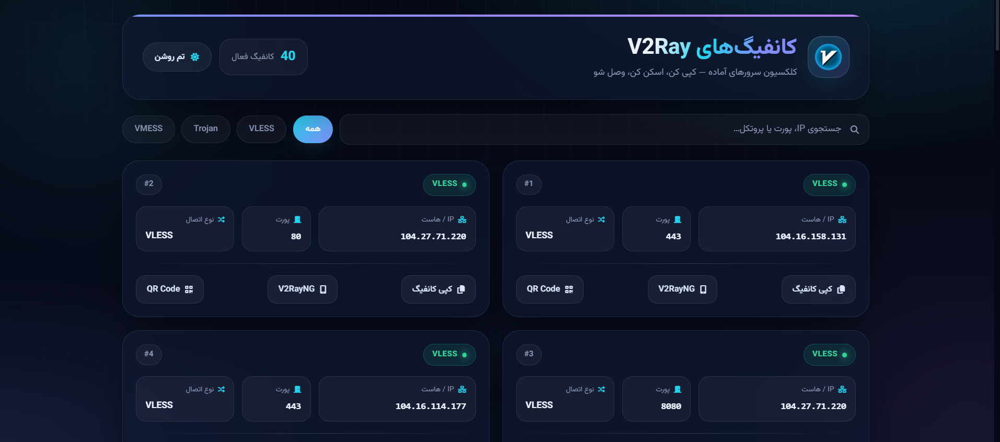

# نمایش‌دهنده کانفیگ V2Ray

یک اپلیکیشن وب سبک PHP برای مرور، جستجو و اشتراک‌گذاری کانفیگ‌های اشتراک V2Ray. برای کاربران فارسی‌زبان طراحی شده — چیدمان RTL، فونت وزیرمتن، تم تیره/روشن، کپی با یک کلیک، کد QR و پشتیبانی از دیپ‌لینک V2RayNG.


## 📥 دانلود

**[مشاهده دمو زنده](#)** • **[گزارش خطا](#)**

## ✨ امکانات

### 🌍 پشتیبانی از چندین پروتکل
پارس و نمایش کانفیگ‌های **VLESS**، **Trojan**، **VMess**، **Shadowsocks**، **HTTP/HTTPS** از فرمت استاندارد URI.

### 📚 پارس هوشمند کانفیگ
استخراج پروتکل، هاست/IP، پورت و یادداشت از هر خط کانفیگ — در کارت‌های تمیز و قابل کپی نمایش داده می‌شود.

### 💬 جستجو و فیلتر
- جستجوی لحظه‌ای بر اساس IP، پورت یا پروتکل
- چیپ‌های فیلتر: همه / VLESS / Trojan / VMess
- نتایج فوری، بدون ریلود صفحه

### ⚙️ عملیات برای هر کانفیگ
- **کپی** کانفیگ خام به کلیپ‌بورد (فیل‌بک برای مرورگرهای قدیمی)
- **کد QR** در مودال برای اسکن موبایل (V2RayNG، v2rayTun و...)
- **دیپ‌لینک V2RayNG** — باز کردن مستقیم کانفیگ در اپ اندروید

### 🎨 رابط کاربری و تجربه کاربری مدرن
- چیدمان RTL فارسی با فونت وزیرمتن
- تم تیره/روشن با ذخیره ترجیح کاربر
- کارت‌های گلاس‌مورفیسم با انیمیشن درخشش هاور
- آرب‌های متحرک و گرید در پس‌زمینه
- انیمیشن ورود کارت‌ها به صورت تدریجی
- نوتیفیکیشن تاست برای موفقیت/خطای کپی

## 📸 اسکرین‌شات



## 🛠 تکنولوژی‌ها

| بخش | ابزار / کتابخانه |
|------|------------------|
| بک‌اند | PHP 8.1+ (نیتیو، بدون فریم‌ورک) |
| فرانت‌اند | Tailwind CSS (CDN)، JS خالص |
| فونت | وزیرمتن (CDN) |
| آیکون | Font Awesome 6 (CDN) |
| کد QR | QRCode.js (CDN) |
| منبع کانفیگ | `sub.txt` محلی یا URL ریموت |

## 📁 ساختار پروژه

```
v2ray/
├── index.php      # نقطه ورودی اصلی — پارسر + HTML + JS (فایل تکی)
├── sub.txt        # کانفیگ‌های اشتراک V2Ray (هر خط یک URI)
├── v2rayn.png     # لوگو در بخش هرو
├── .gitignore
└── README.md
```

**نقاط ورودی کلیدی:**
- `index.php` — دریافت کانفیگ، پارس (`parseConfigInfo()`)، رندرینگ، و تمام منطق کلاینت (تم، جستجو، فیلتر، کپی، QR، V2RayNG)

## 🚀 اجرا و بیلد

1. **کلون کردن مخزن**
   ```bash
   git clone https://github.com/yourusername/v2ray-config-viewer.git
   cd v2ray-config-viewer
   ```

2. **قرار دادن فایل اشتراک**
   - فایل `sub.txt` را با کانفیگ‌های V2Ray خود ویرایش کنید (هر خط یک URI)
   - یا متغیر `$subUrl` در `index.php` را به یک URL خام ریموت تغییر دهید (مثلاً لینک raw گیت‌هاب)

3. **اجرا با سرور داخلی PHP**
   ```bash
   php -S localhost:8000
   ```

4. **باز کردن در مرورگر**
   - به آدرس `http://localhost:8000` بروید

> 💡 **نکته:** برای بارگذاری اسست‌های CDN (Tailwind، Font Awesome، وزیرمتن، QRCode.js) نیاز به اینترنت است. برای استفاده کاملاً آفلاین، آن اسست‌ها را دانلود و لوکال میزبانی کنید.

## 📋 پیش‌نیازها

- PHP 8.1+ (برای `match`، `??`، توابع فلشی)
- وب‌سرور (Apache/Nginx/سازماندهی داخلی PHP) با ماژول PHP
- اتصال اینترنت برای منابع CDN (یا میزبانی لوکال)
- مرورگر مدرن با پشتیبانی ES6+ (Clipboard API، localStorage، fetch)

## 🤝 مشارکت

پرش‌پذیر (PR) خوش‌آمد است! لطفاً شامل موارد زیر باشید:
- توضیح واضح تغییرات
- مراحل بازتولید در صورت رفع باگ
- اسکرین‌شوت برای تغییرات UI

---

ساخته‌شده با ❤️ توسط [امیربهادر امیری](https://github.com/AmirBahadorAmiri)